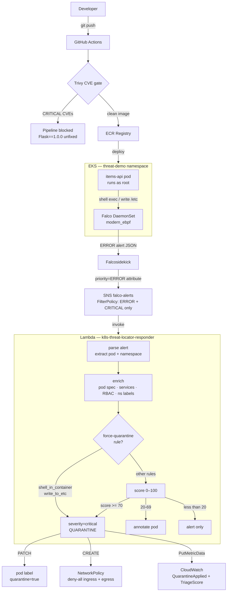
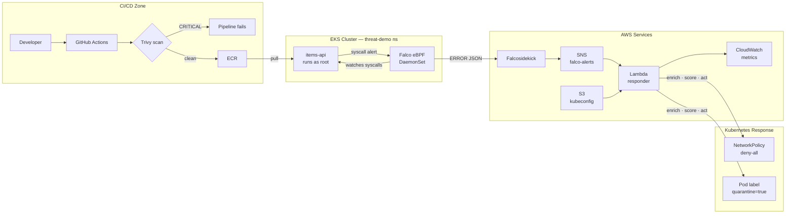
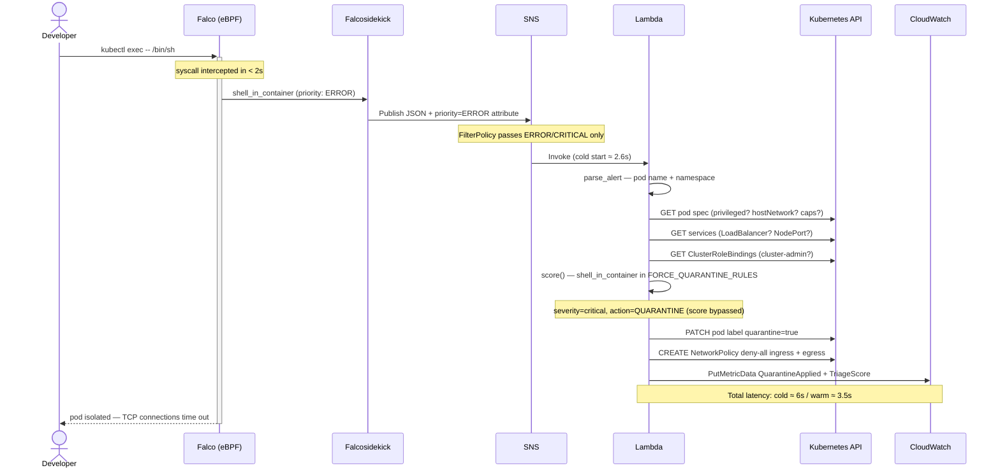

# Architecture Diagrams

## Top-Down Flow

---

## Zone Layout

---

## Incident Timeline

---

## Timing Reference

| Stage | Latency |
|---|---|
| Falco eBPF detection | < 2 s |
| Falcosidekick → SNS | < 1 s |
| Lambda cold start | ≈ 2.6 s |
| k8s API calls + token generation | ≈ 2.8 s |
| **Total (cold start)** | **≈ 6 s** |
| **Total (warm Lambda)** | **≈ 3.5 s** |

## SNS Filter Policy

The SNS subscription uses a `FilterPolicy` that passes only `ERROR` and `CRITICAL` priority alerts to Lambda. `WARNING`-priority rules (e.g. `unexpected_outbound_connection`) are visible via Falcosidekick's other outputs (Slack, S3) but do not trigger automated quarantine.

## Force-Quarantine Rules

Two Falco rules bypass the 0–100 scoring path entirely and always map to `severity=critical, action=QUARANTINE`:

- `shell_in_container` / `Terminal shell in container`
- `write_to_etc` / `Write below etc`

All other rules go through the scoring function, which maps score to action as: `>= 70` critical/quarantine, `40–69` high/quarantine, `20–39` medium/annotate, `< 20` low/alert-only. The threshold for quarantine via scoring is `score >= 40`.
